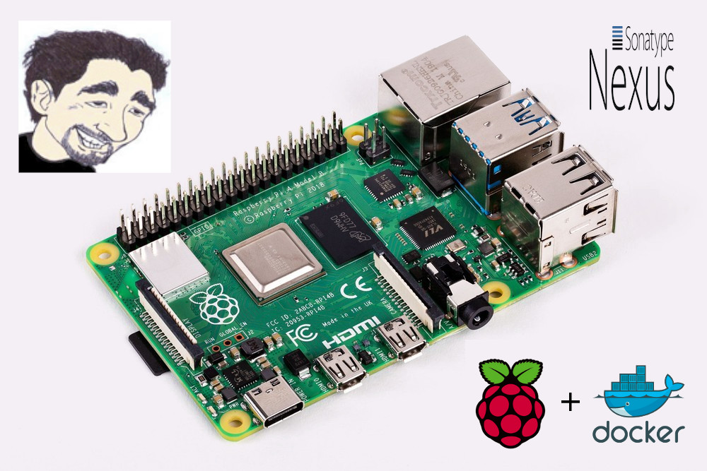
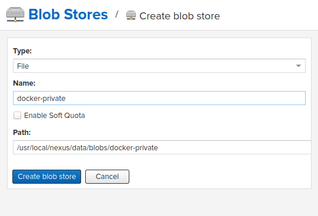
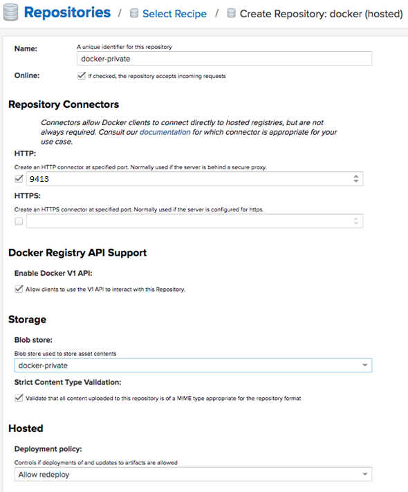
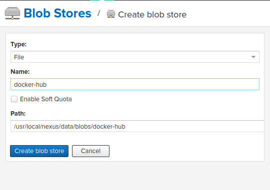
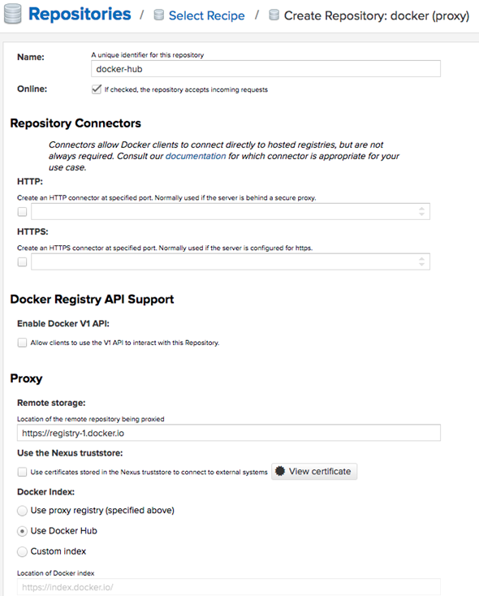
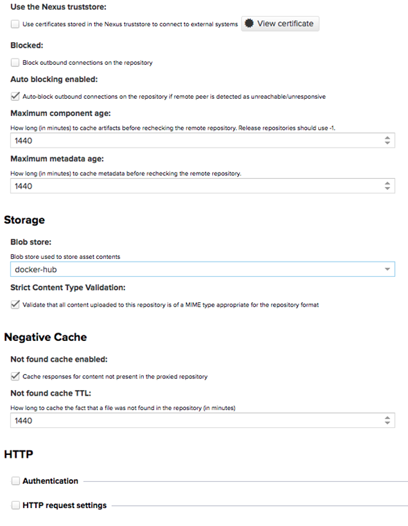
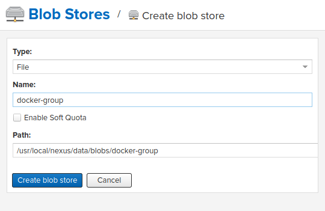
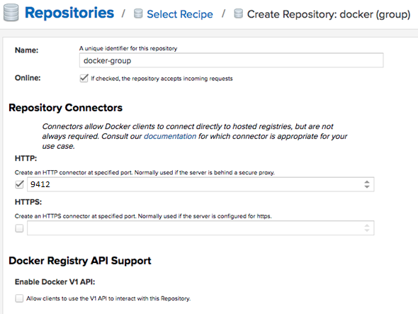
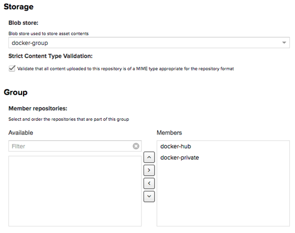

# IOT - Tutorial Nexus Sonatype no Raspberry Pi

[](https://hub.docker.com/r/paperinik/rpi-nexus/)

<a href='https://ko-fi.com/brunocantisano' target='_blank'>

O Raspberry Pi 4, versão mais recente do Mini PC, tem hardwares de: 1Gb, 2Gb ou 4Gb, custando em torno de R$ 140 para a versão de 1Gb e que é ideal para fazer POCs (Proof of concepts).




Com um Raspberry Pi, 
o usuário pode experimentar novas possibilidades e aprender um pouco mais sobre computação, eletrônica e até para desenvolvimento de software com IOT (Internet Of Things).

Neste tutorial, iremos aprender a subir um servidor de artefatos (Nexus Sonatype) em um Raspberry Pi a fim de ter um ambiente pequeno para desenvolvedores utilizarem em seus projetos.

# Nexus

Este container Docker implementa Sonatype Nexus no Raspberry pi.

 * Raspbian base image: [resin/rpi-raspbian](https://hub.docker.com/r/resin/rpi-raspbian/)
 * Nexus Repository Manager OSS 3.29.2-02

Para operar as funcionalidades você precisará usar a ferramenta Makefile.

* Definição:

	 * Um arquivo `Makefile` é um arquivo contendo um conjunto de diretivas usadas pela ferramenta de automação de compilação make para gerar um alvo/meta. Sua função é direcionar o make sobre como compilar e vincular um programa.

### Installation from [Docker registry hub](https://registry.hub.docker.com/u/paperinik/rpi-nexus/).

# Premissas

1) Conhecimento em docker (versão do Docker > 1.12.3)

## Referências:
1)  * [RaspberryPi Wiki](https://pt.wikipedia.org/wiki/Raspberry_Pi)
2) Para quem quiser aprender docker:
    * [Docker](https://www.garagemdigital.io/docker-o-que-e/)
    * [LearnDocker Workshop](https://events.docker.com/learndocker-workshop/)
3) Makefile
	* [Makefile Wikipedia](https://pt.wikipedia.org/wiki/Makefile)
	* [Makefile com Docker](https://medium.com/tech-grupozap/makefile-docker-93a28cd2aa92)
    * Instalação: `sudo apt install build-essential`

- Processos automatizados com make:

* `help`: descreve as tarefas
* `clean`: remove a pasta node_modules
* `repo-login`: faz login no dockerhub
* `build`: crio container
* `build-nc`: crio container sem cache
* `remove`: remove imagem
* `rebuild`: chama as tarefas de `remove` e `build`
* `save`: salva imagem em arquivo
* `load`: carrega imagem previamente salva
* `push`: publica o container no repositório de artefatos
* `pull`: faz o download do container no repositório de artefatos
* `run`: inicializa o container
* `up`: roda as tarefas: build e run
* `dev`: roda as tarefas: build-nc e run
* `stop`: para o container e remove a execução
* `sonar`: roda a análise de código no sonar
* `dangling`: remove todas as imagens do tipo dangling (temporárias)
* `publish-latest`: publica a imagem criada como última no ecr (repositório de artefatos)
* `publish-version`: publica a imagem com a versão corrente no ecr (repositório de artefatos)
* `publish`: roda as tarefas: repo-login, publish-latest e publish-version
* `tag-version`: nomeia a imagem com a versão corrente
* `tag-latest`: nomeia a imagem criada como última
* `tag`: roda as tarefas: tag-latest e tag-version
* `removecontainers`: para todos os containers em execução e remove
* `create-dir:`: cria o diretório do nexus-data
* `sonar`: roda o sonar-scanner para fazer a análise pelo sonar

# Como funciona: 

* Cria o diretório a ser utilizado pelo Nexus

```sh
make create-dir
```

```sh
make run
```

- Rodar comando para descobrir a senha:

```sh
make nexus-pass
```

Exemplo de resultado da execução:

```sh
51bed803-7f61-4c90-97cc-5eac58f502e3
```

- Logar no sistema:

Imagens

- URL para acesso: 
  * http://raspberrypi4:9411 (windows acessando raspberrypi) ou http://raspberrypi4.local:9411 (linux acessando raspberrypi)

    - usuario: `admin`
    - senha: `51bed803-7f61-4c90-97cc-5eac58f502e3`

- Trocar a senha para: `admin123`

# Sonar (opcional)

* O SonarQube é uma plataforma de código aberto desenvolvida pela SonarSource para inspeção contínua da qualidade do código, para executar revisões automáticas com análise estática do código, detectando bugs, "bad smells" e vulnerabilidades de segurança em mais de 20 linguagens de programação.

**No `Makefile` existe uma tarefa para analisar código, mas para isso precisa instalar e configurar o sonar-scanner**

- [Sonar scanner](https://docs.sonarqube.org/display/SCAN/Analyzing+with+SonarQube+Scanner)

# Usando Nexus 3 como seu repositório de artefatos de imagens Docker

## Configurando o Nexus como um repositório Docker

O que faremos: 
- Criar um repositório privado (hospedado) para nossas próprias imagens 
- Criar um repositório proxy apontando para o Docker Hub 
- Criar um repositório de grupo para fornecer todos os repositórios acima em uma única URL.

Crie um novo repositório de blobs para cada novo repositório que você deseja criar. Dessa forma, os dados para cada repo estarão em uma pasta diferente em /nexus-data (dentro do contêiner do Docker). 
Isso não é obrigatório para que funcione porque por padrão o cliente Docker se comunica com o repositório usando HTTPS. No meu caso de uso, foi configurado com HTTP. 

Importante notar: o repositório do Docker requer 2 portas diferentes. Usaremos 9412 para fazer download do repositório de proxy e 9413 para fazer download e upload para o repositório particular. 


## Repositório Privado

Um repositório para imagens do Docker que sua equipe cria. Crie um novo repositório do Docker (hospedado) e configure assim:





Agora temos que autenticar sua máquina no repositório com: 

```json
make repo-login
```

## Repositório Proxy

Um repositório que faz proxy de tudo o que você baixa do registro oficial no Docker Hub. Na próxima vez que você baixar a mesma dependência, ela será armazenada em cache no seu Nexus.
Crie um novo repositório do Docker (proxy) e configure-o como:





## Repositório de Grupo

Isso agrupará todos os repositórios acima e fornecerá uma URL única para configurar seus clientes para fazer o download. Crie um novo repositório do Docker (grupo) e configure-o como:





Você pode criar quantos repositórios precisar e agrupá-los no repositório de grupos. Esta etapa é realmente opcional para usar o Nexus 3 como um repositório do Docker, porque podemos continuar fazendo downloads e uploads para os repositórios proxy e hospedado, como será discutido mais adiante. Configurando seus clientes e projetos para usar seus repositórios Nexus. Para interagir com seu repositório, a primeira coisa é configurar o Docker daemon em sua máquina para aceitar trabalhar com HTTP em vez de HTTPS. Como exatamente fazer essa configuração depende do seu sistema operacional, você deve verificar a documentação do dockerd.

No Raspbian, coloque esse conteúdo em: `/etc/docker/daemon.json`: 

```json
{
  "insecure-registries":
  [
    "raspberrypi4.local:9412",
    "raspberrypi4.local:9413"
  ],
  "debug": true,
  "experimental": true,
  "registry-mirrors": []
}
```

Onde:

* `raspberrypi4.local` é o seu servidor nexus
* `9412` porta privada do servidor nexus
* `9413` porta privada do servidor nexus

Você precisa reiniciar o seu daemon depois de setar isso: `sudo systemctl restart docker`
No Windows ou Mac você deve configurar o seu deamon assim:
Isso irá criar uma entrada no `~/.docker/config.json`

```json
{
  "auths": {
    "raspberrypi4.local:9412": {
      "auth": "YWRtaW46YWRtaW4xMjM="
    },
    "raspberrypi4.local:9413": {
      "auth": "YWRtaW46YWRtaW4xMjM="
    }
  }
}
```

* Para marcar a imagem com uma tag que aponta para o repo e usar a porta `9413`:
- `make tag`

* Para enviar suas próprias imagens para o seu repositório:
- `make publish`

* Para extrair imagens do seu repositório, use a porta `9412`:
- `make pull`

**Ambas as portas funcionarão. O uso da porta `9412` será conectado ao repositório do grupo, que contém o repositório hospedado. Atenha-se à porta `9413` para evitar imagens duplicadas em suas máquinas. Se você escolher ficar com a porta `9413` para obter suas próprias imagens, provavelmente poderá pular a criação do repositório de grupo, se preferir.**

[fixes](https://github.com/bhamail/pinexus/blob/master/src/site/markdown/nexussetup.md.vm)
